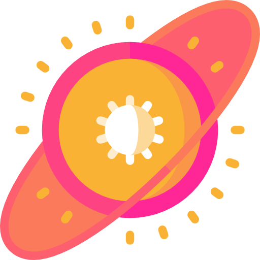

> /ˈsoo-per-noh-vuh/ is the explosion of a star caused by gravitational collapse during which the luminosity increases by as much as 20 magnitudes

Supernova is a library to do event driven architectures in Scala.
   

TBD

logo designed by [FreePik](https://www.flaticon.com/authors/freepik)
